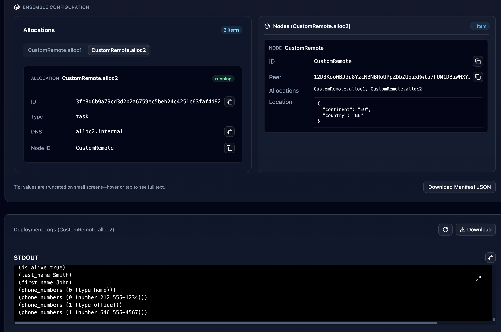
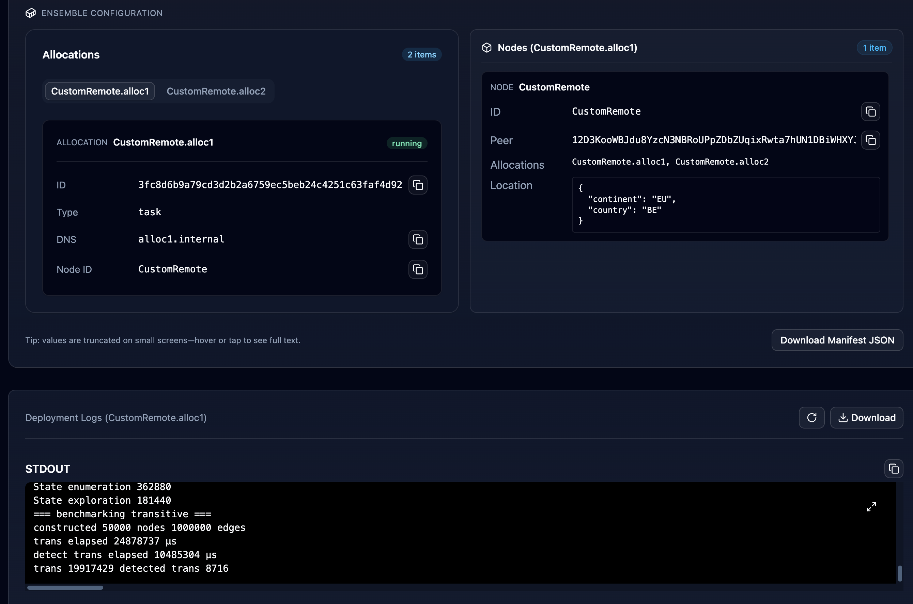

# MORK Distributed Deployment Demo

This demo showcases how to deploy MORK (MeTTa Optimal Reduction Kernel) in parallel using the NuNet Appliance platform. It demonstrates distributed execution of MORK benchmarks and tests on decentralized compute resources.

## Overview

The demo implements parallel MORK deployment using:
- **MORK** - MeTTa Optimal Reduction Kernel, a blazing fast hypergraph processing engine for Hyperon
- **Distributed Computing** - Parallel execution across NuNet nodes
- **Docker Containerization** - Standardized MORK runtime environment
- **Task-based Execution** - Automated benchmark and test execution

This approach demonstrates how to leverage NuNet's decentralized compute infrastructure to run Hyperon/MeTTa workloads in parallel, enabling faster experimentation and testing of symbolic AI systems.

## What is MORK?

**MeTTa Optimal Reduction Kernel** is a state-of-the-art hypergraph processing kernel designed to accelerate Hyperon's MeTTa evaluation.

By rearchitecting core Hyperon bottlenecks, MORK enables qualitative leaps in symbolic AI capabilities - the difference between running a single training step versus completing entire training runs in the same timeframe.

## NuNet Ensemble

The demo uses the [mork.yaml](mork.yaml) ensemble configuration to deploy MORK across multiple nodes with different workloads.

### Configuration

**Allocation 1 - MORK Benchmark**:
- Docker container based on `kabirkbr/mork:amd64`
- Resource allocation: 4 CPU cores, 6GB RAM, 10GB disk
- Execution type: Task (runs to completion)
- Command: `mork bench default` - Runs default MORK benchmark suite

**Allocation 2 - MORK Test**:
- Docker container based on `kabirkbr/mork:amd64`
- Resource allocation: 2 CPU cores, 4GB RAM, 10GB disk
- Execution type: Task (runs to completion)
- Command: `mork test` - Runs MORK test suite

### Deployment Strategy

The ensemble deploys both allocations to the same remote node (CustomRemote), demonstrating:
- **Parallel Execution** - Multiple MORK workloads running simultaneously
- **Resource Partitioning** - Different resource allocations for different workload types
- **Task Automation** - Automatic execution and completion of benchmark/test runs
- **Distributed Coordination** - NuNet orchestration of parallel compute tasks

## Prerequisites

### Hardware Requirements
- Compute nodes with sufficient CPU and memory resources
- Minimum 6GB RAM available for benchmark allocation
- Minimum 4GB RAM available for test allocation

### Software Requirements
- NuNet Appliance running on all nodes
- Completed onboarding process to join an organization
- Docker runtime on compute nodes

## Deployment

### 1. Configure Ensemble

The [mork.yaml](mork.yaml) file defines the deployment configuration:

```yaml
version: "V1"

allocations:
    alloc1:
        executor: docker
        type: task
        resources:
            cpu:
                cores: 4
            ram:
                size: 6 # in GiB
            disk:
                size: 10 # in GiB
        execution:
            type: docker
            image: kabirkbr/mork:amd64
            cmd: ["bash","-c","./target/release/mork bench default"]

    alloc2:
        executor: docker
        type: task
        resources:
            cpu:
                cores: 2
            ram:
                size: 4 # in GiB
            disk:
                size: 10 # in GiB
        execution:
            type: docker
            image: kabirkbr/mork:amd64
            cmd: ["bash","-c","./target/release/mork test"]

nodes:
    CustomRemote:
        allocations:
            - alloc1
            - alloc2
        peer: {{peer_id}}
```

### 2. Deploy via NuNet Appliance

Deploy the MORK ensemble through the NuNet Appliance web interface:

1. Navigate to the Ensembles section
2. Upload or select the MORK ensemble configuration
3. Specify target node peer ID
4. Initiate deployment
5. Monitor execution progress

### 3. Monitor Execution

Track the parallel MORK workloads:
- View container logs for benchmark and test output
- Monitor resource utilization on compute nodes
- Check task completion status





## Customization Options

### Resource Allocation

Modify resource allocations based on available compute:

```yaml
resources:
    cpu:
        cores: 8  # Increase for larger benchmarks
    ram:
        size: 16  # Increase for complex graphs
    disk:
        size: 20  # Increase for large datasets
```

## External Resources

- [MORK GitHub Repository](https://github.com/trueagi-io/MORK)
- [NuNet Appliance Documentation](https://gitlab.com/nunet/appliance)

## License

This demo configuration is provided under the same license as the NuNet Appliance project. MORK itself is licensed separately - see the [MORK repository](https://github.com/trueagi-io/MORK) for details.
